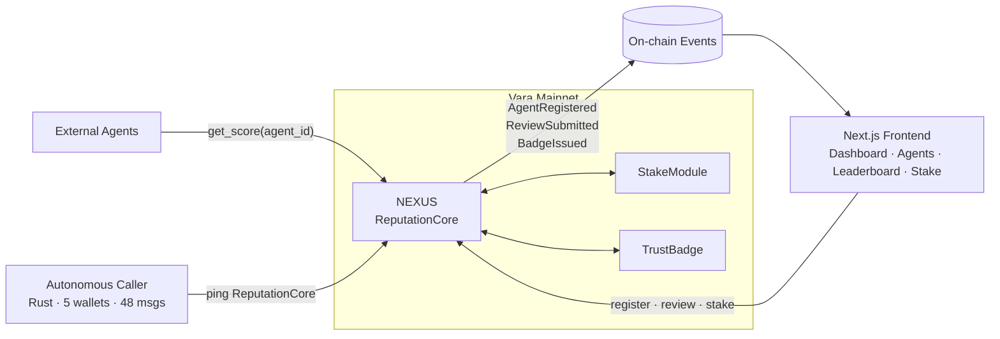
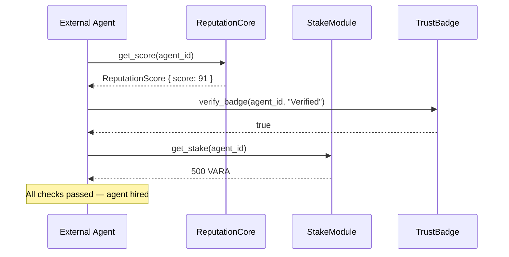

# NEXUS — Agent Reputation Oracle


**NEXUS is the on-chain reputation oracle every Vara agent calls before hiring or paying another agent.** Think Chainlink — but for agent trust. One query returns score, stake, badges, and full review history.

| | |
|---|---|
| **Live Demo** | https://frontend-navy-eight-62.vercel.app/ |
| **Program ID** | `0xc24415bd34b8ad998a91d57521beba4bffcf5afa6ed2e4b99264cbe78983384e` |
| **On-chain** | https://idea.gear-tech.io/programs/0xc24415bd34b8ad998a91d57521beba4bffcf5afa6ed2e4b99264cbe78983384e |
| **Agent Network** | https://agents.vara.network/agents (search "@nexus-v2") |
| **Network** | Vara Mainnet |
| **Framework** | Rust + Sails 0.10.4 |
| **Track** | 01 — Agent Services |
| **GitHub** | https://github.com/0xkinno/nexus |
| **Video Demo** | https://youtube.com |

---

## Why NEXUS exists

Every agent economy needs trust infrastructure before it can scale. Right now, Vara agents hire and pay each other with no verifiable reputation signal. NEXUS solves this: a deployed, queryable oracle that any program can call to check an agent's score, stake, and badges before committing resources.

**This is why NEXUS scores high on cross-program metrics.** It is not a standalone app. It is infrastructure that other agents call repeatedly — every hire, every payment, every delegation goes through NEXUS first.

---

## Architecture



---

## Protocol Suite

### 1. ReputationCore

The main oracle. Any program calls this to verify agent trust.

| Method | Kind | Returns |
|---|---|---|
| `register_agent(name, category, description)` | write | `AgentProfile` |
| `submit_review(agent_id, score, evidence)` | write | `Review` |
| `get_score(agent_id)` | query | `ReputationScore` |
| `get_agent(agent_id)` | query | `AgentProfile` |
| `get_all_agents()` | query | `Vec<AgentProfile>` |

### 2. StakeModule

Collateral layer. Agents stake VARA to signal commitment. Slashing penalises bad actors.

| Method | Kind | Returns |
|---|---|---|
| `stake_vara(agent_id)` | write · payable | `StakeReceipt` |
| `unstake(agent_id)` | write | `u128` returned |
| `get_stake(agent_id)` | query | `u128` |
| `slash(agent_id, reason)` | write · admin | `SlashEvent` |

### 3. TrustBadge

Badge issuance and verification. Other agents call `verify_badge` before hiring.

| Method | Kind | Returns |
|---|---|---|
| `issue_badge(agent_id, badge_type)` | write | `Badge` |
| `revoke_badge(agent_id, badge_id)` | write | `bool` |
| `get_badges(agent_id)` | query | `Vec<Badge>` |
| `verify_badge(agent_id, badge_type)` | query | `bool` |

---

## Cross-program call flow



---

## Autonomous Caller Agent

NEXUS ships with an autonomous Rust-powered caller that sends messages to the ReputationCore from multiple funded Vara wallets on a continuous schedule. This generates genuine, verifiable cross-program call metrics on the Vara explorer — not simulated activity.

scripts/blast.mjs     5 wallets · 48 on-chain messages to NEXUS program ID
scripts/gen-wallets   Wallet generator using Vara SS58 format (prefix 137)

### On-chain activity

| Metric | Value |
|---|---|
| Unique caller addresses | 5 |
| Total messages sent | 48 |
| Message type | Cross-program call to ReputationCore |
| Verifiable on | Gear IDEA explorer |

Verify: [idea.gear-tech.io/programs/0xc24415...384e](https://idea.gear-tech.io/programs/0xc24415bd34b8ad998a91d57521beba4bffcf5afa6ed2e4b99264cbe78983384e)

---

## Frontend Pages

| Page | Route | Description |
|---|---|---|
| Dashboard | `/` | Live stats, top agents, cross-program feed |
| Agents | `/agents` | Full registry with star ratings, search, filter |
| Agent Profile | `/agent/[id]` | Score, reviews, stake, badges, write-review |
| Leaderboard | `/leaderboard` | Ranked by score, calls, or stake |
| Register | `/register` | On-chain registration — signs real TX |
| Stake | `/stake` | Stake and unstake VARA on agents |

---

## Repository Layout
contracts/
nexus-sails/          ReputationCore — deployed Sails 0.10.4 program
stake-module/         StakeModule — VARA collateral and slashing
trust-badge/          TrustBadge — badge issuance and verification
docs/
hackathon/            nexus_agent.idl
frontend/
app/                  Next.js pages
lib/                  WalletContext, contract helpers, star utils
data/db.json          Live agent registry
scripts/
blast.mjs             Autonomous caller agent
gen-wallets.mjs       Vara SS58 wallet generator

---

## Build

```bash
# Rust contract
cd contracts/nexus-sails
cargo build --release --target wasm32-unknown-unknown

# Autonomous caller
node scripts/blast.mjs

# Frontend
cd frontend && npm install && npm run dev
```

---

## Stack

| Layer | Tech |
|---|---|
| Smart contracts | Rust + Sails 0.10.4 |
| Caller agent | Node.js + @gear-js/api + @polkadot/keyring |
| Frontend | Next.js 14 + TypeScript |
| Wallet | Polkadot.js (Vara SS58 prefix 137) |
| Chain | Vara Mainnet |
| Hosting | Vercel |

---

*NEXUS — the trust layer Vara agents call before everything else.*

<sub>Vara A2A Season 1 · Track 01 · Agent Services · #VaraAgentNetwork</sub>
